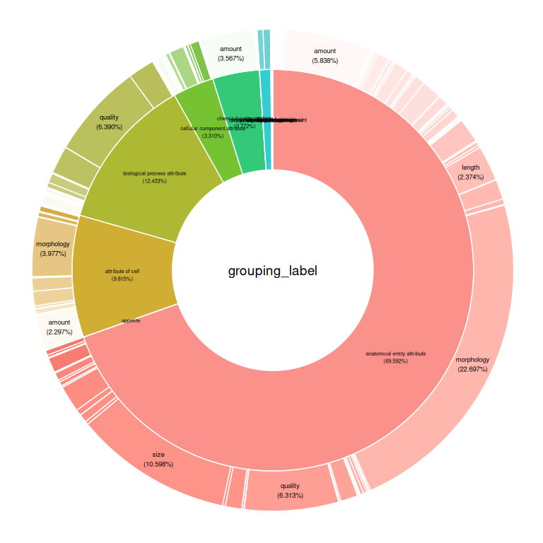

OBA Nested Pie Chart
================

This is a nested by chart OBA. First I grouped the data frame using
**grouping_label** and **attribute_label**. Then, I summed the **count**
values by group.

## TOP 10 Values by Count

``` r
library(ggplot2)
library(webr)
library(dplyr)
library(data.table)


df <- fread('./oba.csv')

df_gb <- df %>%
  dplyr::group_by(grouping_label, attribute_label) %>%
  dplyr::summarise(n = sum(count)) %>%
  dplyr::arrange(desc(n)) %>%
  head(10)
```

I had to took only the first 10 values (sorted by sum count in
descendant way). Otherwise the plot will be very *“poluted”*.

``` r
PieDonut(
  df_gb,
  aes(attribute_label, grouping_label, count = n),
  addDonutLabel = F,
  r0 = 0.45,
  r1 = 0.9,
  labelposition=0,
  donutLabelSize=2.5,
  pieLabelSize=2.5,
  addPieLabel = F,
  showPieName = F
  
)
```

<!-- -->

------------------------------------------------------------------------

## TOP 20 Values by Count

``` r
df_gb <- df %>%
  dplyr::group_by(grouping_label, attribute_label) %>%
  dplyr::summarise(n = sum(count)) %>%
  dplyr::arrange(desc(n)) %>%
  head(20)

PieDonut(
  df_gb,
  aes(attribute_label, grouping_label, count = n),
  addDonutLabel = F,
  r0 = 0.45,
  r1 = 0.9,
  labelposition=0,
  donutLabelSize=2.5,
  pieLabelSize=2.5,
  addPieLabel = F,
  showPieName = F
  
)
```

<!-- -->
