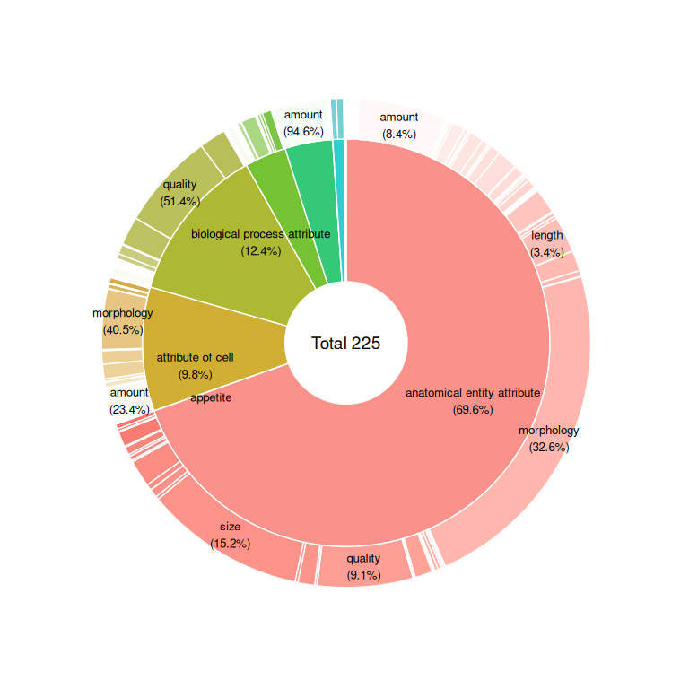

OBA Nested Pie Chart
================

This is a nested by chart OBA. First I grouped the data frame using
**grouping_label** and **attribute_label**. Then, I summed the **count**
values by group.

``` r
library(ggplot2)
source('./piedonut.r')
library(dplyr)
library(data.table)
library(ggrepel)

df <- fread('./oba.csv')
```

------------------------------------------------------------------------

## Nested pie chart

``` r
df_gb <- df %>%
  dplyr::group_by(grouping_label, attribute_label) %>%
  dplyr::summarise(n = sum(count)) %>%
  dplyr::arrange(desc(n))

PieDonut(
  df_gb,
  aes(grouping_label, attribute_label, count = n),
  addDonutLabel = F,
  labelposition=0,
  donutLabelSize=3.5,
  pieLabelSize=3.5,
  showDonutName = F,
  pieName=paste("Total", nrow(df)),
  ratioByGroup=T,
  r0=0.3,
  
)
```

<!-- -->
